# 👋 Hi, I'm Max!

### BI & Data Analyst

 

---

## About

My path is not linear, that is my strength. From public law to business intelligence via computer systems, I put the rigour of evidence at the service of data to produce analyses that genuinely inform strategic decisions.

---

## Featured Projects

### 🌍 [Global Economic Intelligence Dashboard](https://github.com/maxin-dac/world-economic-dashboard)

An integrated bilingual platform (EN/FR) analyzing global economies using a PESTEL approach. 217 countries · 2000-2024 · 58 structured World Bank indicators.

---

### 🛰 [Country Risk Desk](https://github.com/maxin-dac/country-risk-desk)

Macro-financial country risk analysis tool, based exclusively on official data and documented rules. Scenario analysis for risk/opportunity assessment. Bilingual interface 🇫🇷/🇬🇧 · 217 economies · 17 indicators · sovereign ratings from S&P, Moody's, and Fitch · official sources.

🚧 More projects in progress - open to collaborations!

---

## Tech Stack

<!-- STACK:START -->
           
<!-- STACK:END -->

---

## Certifications & Continuous Improvement

**Microsoft Certified**

   

**Other**

 

**Microsoft Applied Skills (17)**

| Skill | Earned |
|-------|--------|
| Implement a Real-Time Intelligence solution with Microsoft Fabric | Dec 2025 |
| Generate reports with AI research agents | Nov 2025 |
| Streamline business workflows with AI chat | Dec 2025 |
| Get started developing agents in Microsoft Foundry | Jul 2026 |

<b>13 more applied skills</b>

 

| Skill | Earned |
|-------|--------|
| Protect information in Microsoft 365 Copilot by using Microsoft Purview | Sep 2026 |
| Manage GitHub secret scanning by using GitHub Copilot | Jul 2026 |
| Resolve GitHub issues by using GitHub Copilot | Jul 2026 |
| Accelerate AI-assisted development by using GitHub Copilot | Dec 2025 |
| Secure Azure services and workloads with Microsoft Defender for Cloud | Dec 2025 |
| Secure storage for Azure Files and Azure Blob Storage | Dec 2025 |
| Secure AI solutions in the cloud | Dec 2025 |
| Get started with cloud security and monitoring tasks | Dec 2025 |
| Implement retention, eDiscovery, and Communication Compliance in Microsoft Purview | Dec 2025 |
| Implement information protection and DLP by using Microsoft Purview | Dec 2025 |
| Deploy and configure Azure Monitor | Dec 2025 |
| Get started with Azure management tasks | Dec 2025 |
| Get started with identities and access using Microsoft Entra | Dec 2025 |

🏅 [Microsoft Certifications & Applied Skills - Official Transcript](https://learn.microsoft.com/en-us/users/maximendacleu-3447/transcript/vjjnkuwyoknz4nq?source=docs)

---

## Activity

<table>
<tr>
<td align="center">

**Repositories**  

</td>
<td align="center">

**Last active**  

</td>
</tr>
</table>

<b>Open to Data Analyst / BI Analyst / Market Research roles</b>

